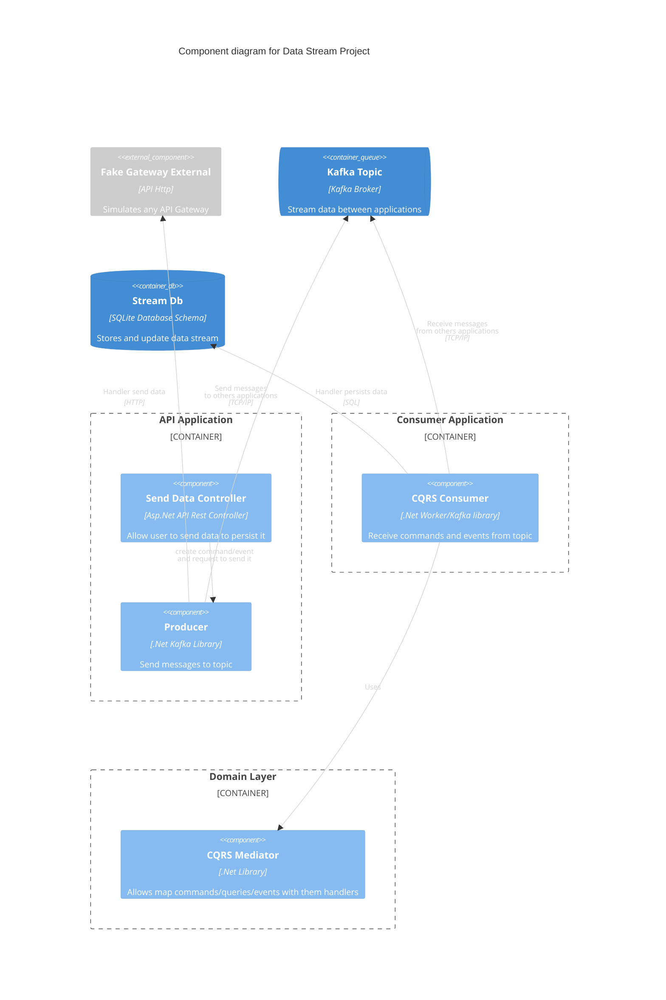

# Components Diagram 

```mermaid
C4Component
    title Component diagram for Data Stream Project
    
    Component_Ext(fakehttp, "Fake Gateway External", "API Http", "Simulates any API Gateway")
    ContainerQueue(kafka, "Kafka Topic", "Kafka Broker", "Stream data between applications")    
    ContainerDb(db, "Stream Db", "SQLite Database Schema", "Stores and update data stream")        

    Container_Boundary(api, "API Application") {
        Component(controller, "Send Data Controller", "Asp.Net API Rest Controller", "Allow user to send data to persist it")
        Component(producer, "Producer", ".Net Kafka Library", "Send messages to topic")

        Rel(controller, producer, "create command/event <br>and request to send it")
        Rel(producer, fakehttp, "Handler send data", "HTTP")
        Rel(producer, kafka, "Send messages <br> to others applications", "TCP/IP")

        UpdateRelStyle(controller, producer, $lineColor="lightgrey", $textColor="lightgrey", $offsetX="-60", $offsetY="-30")
        UpdateRelStyle(producer, fakehttp, $lineColor="lightgrey", $textColor="lightgrey", $offsetX="-120", $offsetY="-30")
        UpdateRelStyle(producer, kafka, $lineColor="lightgrey", $textColor="lightgrey", $offsetX="-120", $offsetY="-30")
    }

    Container_Boundary(consumer, "Consumer Application") {
        Component(consumer, "CQRS Consumer", ".Net Worker/Kafka library", "Receive commands and events from topic")

        Rel(consumer, kafka, "Receive messages <br> from others applications", "TCP/IP")
        Rel(consumer, db, "Handler persists data", "SQL")

        UpdateRelStyle(consumer, kafka, $lineColor="lightgrey", $textColor="lightgrey", $offsetX="10", $offsetY="-30")
        UpdateRelStyle(consumer, db, $lineColor="lightgrey", $textColor="lightgrey", $offsetX="10", $offsetY="-30")
    }

    Container_Boundary(domain, "Domain Layer") {
        Component(mediator, "CQRS Mediator", ".Net Library", "Allows map commands/queries/events with them handlers")
        
        Rel(consumer, mediator, "Uses")
        UpdateRelStyle(consumer, mediator, $lineColor="lightgrey", $textColor="lightgrey", $offsetX="10", $offsetY="0")
    }

    UpdateLayoutConfig($c4ShapeInRow="3", $c4BoundaryInRow="2")

```