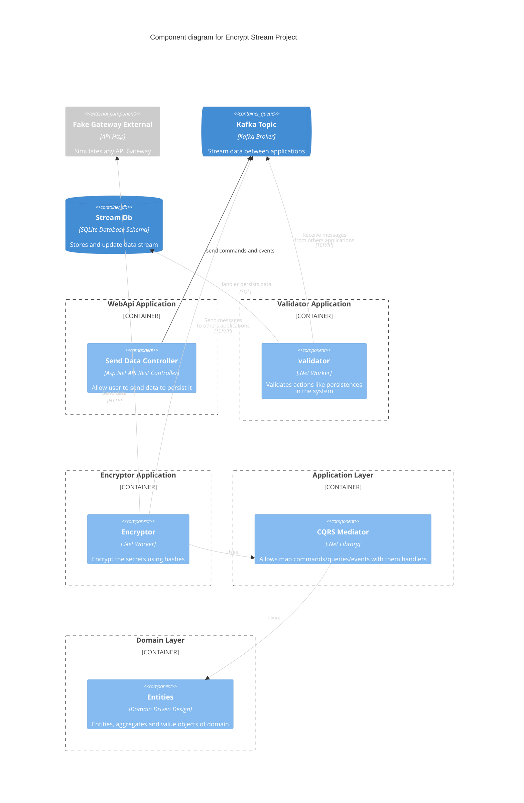

# Components Diagram 

```mermaid
C4Component
    title Component diagram for Encrypt Stream Project
    
    Component_Ext(fakehttp, "Fake Gateway External", "API Http", "Simulates any API Gateway")

    ContainerQueue(kafka, "Kafka Topic", "Kafka Broker", "Stream data between applications") 
       
    ContainerDb(db, "Stream Db", "SQLite Database Schema", "Stores and update data stream")        

    Container_Boundary(api, "WebApi Application") {
        Component(controller, "Send Data Controller", "Asp.Net API Rest Controller", "Allow user to send data to persist it")

        Rel(controller, kafka, "send commands and events")    
    }

    Container_Boundary(validator, "Validator Application") {
        Component(validator, "validator", ".Net Worker", "Validates actions like persistences<br> in the system")

        Rel(validator, kafka, "Receive messages <br> from others applications", "TCP/IP")
        Rel(validator, db, "Handler persists data", "SQL")

        UpdateRelStyle(validator, kafka, $lineColor="lightgrey", $textColor="lightgrey", $offsetX="10", $offsetY="-30")
        UpdateRelStyle(validator, db, $lineColor="lightgrey", $textColor="lightgrey", $offsetX="10", $offsetY="-30")
    }

    Container_Boundary(encryptor, "Encryptor Application", ".Net Worker") {
        Component(encryptor, "Encryptor", ".Net Worker", "Encrypt the secrets using hashes")

        Rel(encryptor, fakehttp, "Send data", "HTTP")
        Rel(encryptor, kafka, "Send messages <br> to others applications", "TCP/IP")
    }

    Container_Boundary(application, "Application Layer") {
        
        Component(mediator, "CQRS Mediator", ".Net Library", "Allows map commands/queries/events with them handlers")

            
        Rel(encryptor, mediator, "Uses")
        Rel(encryptor, mediator, "Uses")

        UpdateRelStyle(encryptor, mediator, $lineColor="lightgrey", $textColor="lightgrey", $offsetX="10", $offsetY="0")
        UpdateRelStyle(encryptor, mediator, $lineColor="lightgrey", $textColor="lightgrey", $offsetX="10", $offsetY="0")
        UpdateRelStyle(encryptor, fakehttp, $lineColor="lightgrey", $textColor="lightgrey", $offsetX="-60", $offsetY="130")
        UpdateRelStyle(encryptor, kafka, $lineColor="lightgrey", $textColor="lightgrey", $offsetX="-10", $offsetY="-30")
        UpdateRelStyle(controller, encryptor, $lineColor="lightgrey", $textColor="lightgrey", $offsetX="-60", $offsetY="-70")
    }

    Container_Boundary(domain, "Domain Layer") {
        Component(entities, "Entities", "Domain Driven Design", "Entities, aggregates and value objects of domain")
        
        Rel(mediator, entities, "Uses")
        UpdateRelStyle(mediator, entities, $lineColor="lightgrey", $textColor="lightgrey", $offsetX="0", $offsetY="-10")
    }

    UpdateLayoutConfig($c4ShapeInRow="3", $c4BoundaryInRow="2")

```