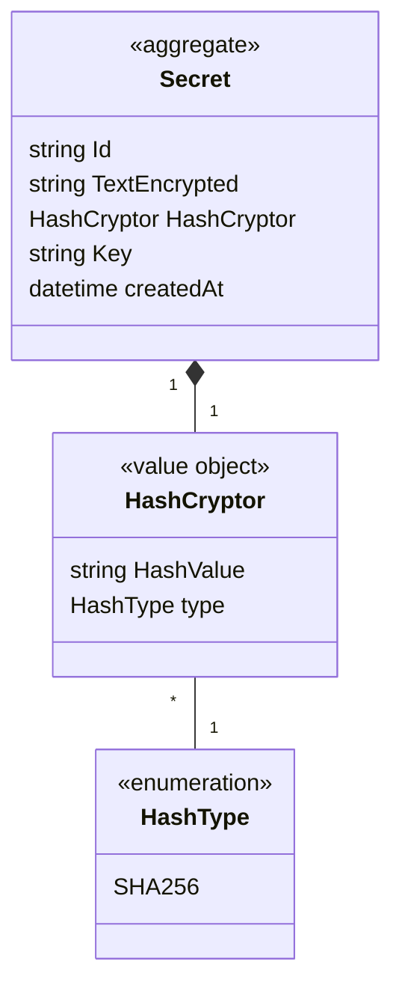

# Domain Diagram

```mermaid
classDiagram 

    class Secret{
        <<aggregate>>
        string Id
        string TextEncrypted
        HashCryptor HashCryptor
        string Key
        datetime createdAt
    }

    class HashCryptor{
        <<value object>>
        string HashValue
        HashType type
    }

    class HashType{
        <<enumeration>>
        SHA256
    }

    Secret "1" *-- "1" HashCryptor
    HashCryptor "*" -- "1" HashType
```