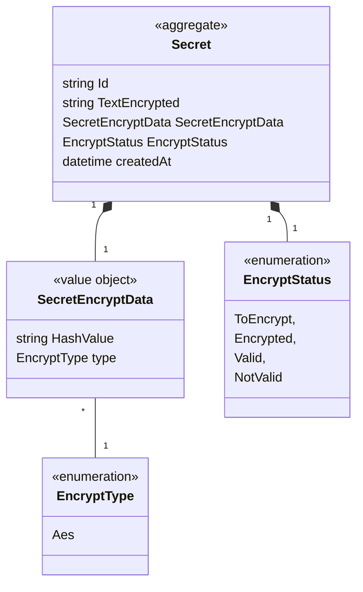

# Domain Diagram

```mermaid
classDiagram 

    class Secret {
        <<aggregate>>
        string Id
        string TextEncrypted
        SecretEncryptData SecretEncryptData
        EncryptStatus EncryptStatus
        datetime createdAt
    }

    class SecretEncryptData{
        <<value object>>
        string HashValue
        EncryptType type
    }

    class EncryptType{
        <<enumeration>>
        Aes
    }
    
    class EncryptStatus{
        <<enumeration>>
        ToEncrypt,
        Encrypted,
        Valid,
        NotValid
    }

    Secret "1" *-- "1" SecretEncryptData
    Secret "1" *-- "1" EncryptStatus
    SecretEncryptData "*" -- "1" EncryptType
```